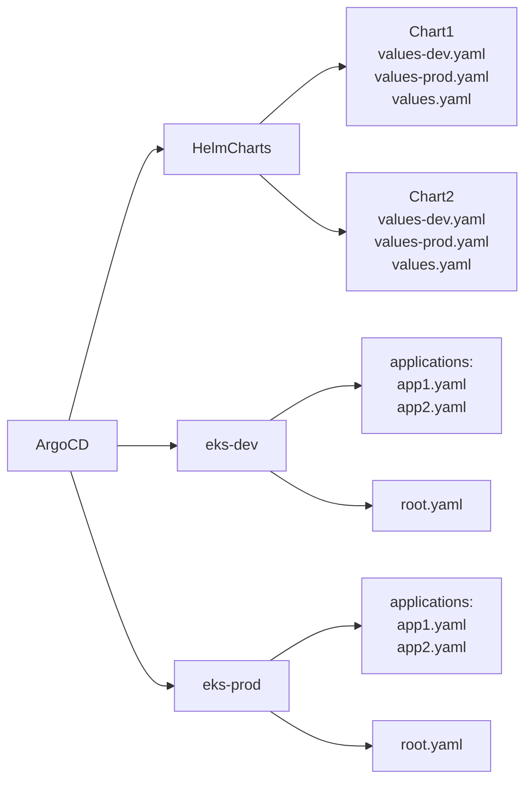

# GitOps Architecture with ArgoCD on AWS EKS


## Overview

This repository demonstrates a GitOps implementation for managing multiple EKS clusters on AWS using ArgoCD and Helm Charts. The architecture is designed to support both development and production environments while maintaining clear separation of concerns and configuration management.

## Architecture

Our GitOps architecture follows these key principles:
- Infrastructure as Code (IaC)
- Configuration version control
- Declarative definitions
- Automated deployments
- Environment segregation

### Structure Diagram



## Repository Structure

```plaintext
.
├── HelmCharts/                 # Helm Charts directory
│   ├── Chart1/
│   │   ├── Chart.yaml         # Chart definition
│   │   ├── templates/         # Kubernetes manifests templates
│   │   ├── values-dev.yaml    # Development values
│   │   ├── values-prod.yaml   # Production values
│   │   └── values.yaml        # Default values
│   └── Chart2/
│       ├── Chart.yaml
│       ├── templates/
│       ├── values-dev.yaml
│       ├── values-prod.yaml
│       └── values.yaml
│   
├── eks-dev/             # Development cluster configurations
│   ├── applications/
│   │   ├── app1.yaml         # ArgoCD Application definition
│   │   └── app2.yaml         # ArgoCD Application definition
│   └── root.yaml             # Root Application definition
│
└── eks-prod/           # Production cluster configurations
    ├── applications/
    │   ├── app1.yaml
    │   └── app2.yaml
    └── root.yaml
```

## Components

### HelmCharts Directory
- Contains all Helm charts used in the infrastructure
- Each chart includes:
  - Base configuration (`values.yaml`)
  - Environment-specific values (`values-dev.yaml`, `values-prod.yaml`)
  - Kubernetes manifest templates
  - Chart metadata and dependencies

### Cluster Directories (eks-dev, eks-prod)
- Separate directories for each EKS cluster
- Contains:
  - ArgoCD Application definitions
  - Root application configuration
  - Environment-specific settings

### Application Definitions
- Located in `applications/` directory within each cluster
- Define which charts to deploy
- Specify source repository and target cluster
- Include environment-specific configurations

## Setup and Usage

### Prerequisites
- AWS CLI configured with appropriate permissions
- kubectl installed and configured
- Helm 3.x installed
- ArgoCD CLI installed

### Initial Setup

1. **Configure AWS CLI**
   ```bash
   aws configure
   ```

2. **Connect to EKS Cluster**
   ```bash
   aws eks update-kubeconfig --name cluster-name --region region
   ```

3. **Install ArgoCD**
   ```bash
   kubectl create namespace argocd
   kubectl apply -n argocd -f https://raw.githubusercontent.com/argoproj/argo-cd/stable/manifests/install.yaml
   ```

4. **Apply Root Application**
   ```bash
   kubectl apply -f eks-dev/root.yaml
   ```

### Adding New Applications

1. Create a new Helm chart in `HelmCharts/` directory
2. Add environment-specific values files
3. Create application definition in appropriate cluster directory
4. Update root application if necessary

## Best Practices

### Version Control
- Use semantic versioning for Helm charts
- Tag all production deployments
- Maintain a changelog

### Configuration Management
- Keep sensitive data in AWS Secrets Manager or Kubernetes Secrets
- Use environment-specific value files
- Document all configuration options

### Security
- Follow least privilege principle
- Regular security scanning of Helm charts
- Implement network policies
- Use RBAC for access control

### Monitoring and Logging
- Configure monitoring for all applications
- Set up centralized logging
- Implement alerts for critical components

## Troubleshooting

Common issues and solutions:

1. **ArgoCD Sync Issues**
   - Verify Git repository access
   - Check application logs
   - Validate Helm chart values

2. **EKS Connectivity**
   - Confirm AWS credentials
   - Check VPC and security group settings
   - Verify kubectl configuration

3. **Helm Chart Problems**
   - Validate chart syntax
   - Check dependencies
   - Verify values files format

## Contributing

1. Fork the repository
2. Create a feature branch
3. Make your changes
4. Submit a pull request

## License

This project is licensed under the MIT License - see the LICENSE file for details.
